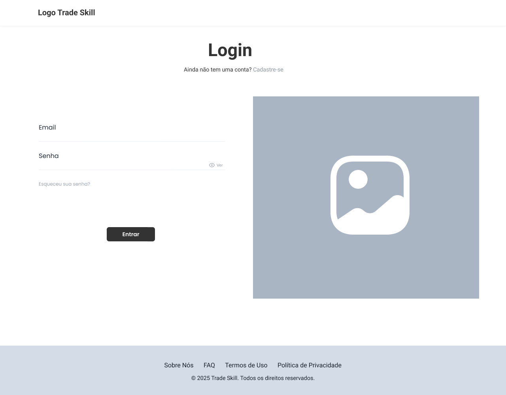

# Projeto de Interface

O projeto de interface tem como objetivo estruturar visualmente a interação entre o usuário e a aplicação, garantindo uma navegação clara, acessível e alinhada aos objetivos do sistema. Ele abrange a definição do fluxo de navegação do usuário (user flow) e a elaboração dos wireframes das principais telas.

A construção das interfaces foi guiada pelos requisitos funcionais, não funcionais e histórias de usuário abordados nas <a href="2-Especificação do Projeto.md"> Documentação de Especificação</a>.
Os wireframes apresentados a seguir demonstram como as funcionalidades foram distribuídas nas telas, priorizando a usabilidade, a coerência visual e a eficiência na execução das tarefas pelos usuários.

## User Flow

|  |
|:--------------------------------------------------------------------------------------------:|
| **Figura 1: Fluxo do Usuário (User Flow)**                                                  |

## Wireframes

São protótipos usados em design de interface para sugerir a estrutura de um site web e seu relacionamentos entre suas páginas. Um wireframe web é uma ilustração semelhante do layout de elementos fundamentais na interface e é fundamental sempre relacionar cada wireframe com o(s) requisito(s) que ele atende.

### Tela de Login

||
|:--------------------------------------------------------------------------------------------:|
| **Figura 2: Tela de Login**   

| **Componente**               | **Requisitos Atendidos**                                                                 |
|------------------------------|------------------------------------------------------------------------------------------|
| **Tela de Login**              | RF01:	Permitir o login por e-mail e senha.   RF02:	Permitir o cadastro com nome, e-mail e senha.   RF04: Permitir a recuperação de senha por resposta de segurança.|
